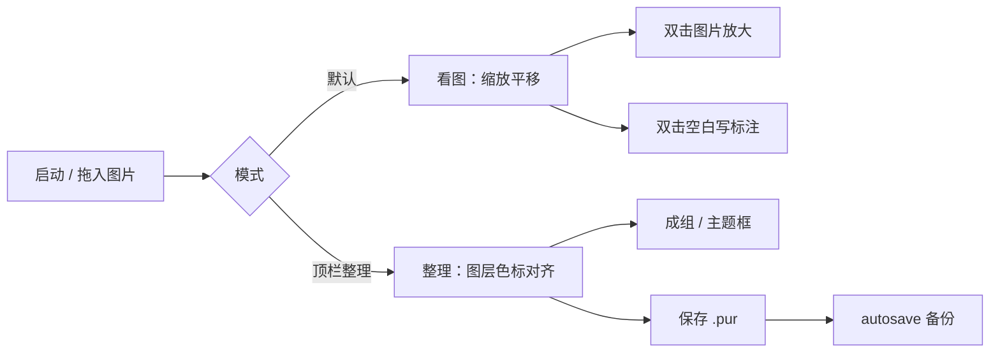

# RefBoard PRD — 设计师工作台（v1.0 已实现版）

> **文档版本**：与代码同步 · **产品版本**：1.0.0  
> **仓库**：https://github.com/art13817979231-svg/kantu  
> **技术栈**：Tauri 2 + React 19 + Konva + Zustand  
> **定位**：面向插画 / UI / 3D 创作者的**桌面参考图工作台**——在 PureRef 式轻量画布上，强化组织、标注、对比与会话管理。

---

## 1. 产品定位

### 1.1 一句话

**副屏常驻的参考图工作台**——拖入即看、可标注、可分组，支持多画板与项目文件，而不是单纯的「图片铺满桌面」。

### 1.2 与 PureRef 的差异

| 维度 | PureRef | RefBoard（当前） |
|------|---------|----------------|
| 核心 | 极简铺图 | 铺图 + 看图 / 整理双模式 |
| 结构 | 几乎无 UI | 可折叠侧栏（图层 / 分类 / 项目） |
| 组织 | 弱 | 色标、分类、逻辑组 / 主题框、多画板 |
| 标注 | 无 | 画布文本标注（背景色预设） |
| 项目 | 单文件 | `.pur`（ZIP）+ 自动保存 + 未命名草稿 |
| 格式 | 官方 `.pur` | **自定义 `.pur`，不兼容** |
| 协作 | 无 | 导出 PNG / 联系表（本地） |

### 1.3 明确不做（当前版本）

- 矢量绘图、笔刷、路径编辑  
- 多人实时协作、云同步、账号体系  
- 自由文本标签（Tag）云 —— 已用**预设色标 + 命名分类**替代  
- Figma 级完整标注（箭头、评论线程）  
- 撤销 / 重做（v1.1 规划）  
- 图层列表虚拟化（图量极大时可能卡顿）  
- 浏览器完整能力（`.pur` 读写、副窗口等仅桌面版）

---

## 2. 双模式：看图 vs 整理

产品默认进入 **看图模式**，降低干扰；需要图层、色标、对齐、主题框时切换到 **整理模式**。

| 模式 | 目标用户行为 | 顶栏 / 侧栏 |
|------|----------------|-------------|
| **看图** `view` | 拖入即看、缩放平移、双击放大单图、双图对照、写简短标注 | 侧栏偏「分类 + 最近项目」；隐藏画框 / 主题框等整理入口 |
| **整理** `organize` | 图层排序、色标筛选、对齐分布、成组、画主题框、联系表导出 | 完整工具栏与图层能力 |

切换：顶栏 **「看图」/「整理」**；整理模式下可 **「返回看图」**。

---

## 3. 用户画像与核心场景

### 3.1 用户画像

| 角色 | 诉求 |
|------|------|
| 插画师 | 角色 / 场景参考分画板或成组，便签式标注 |
| UI 设计师 | 组件截图并排、置顶对照、按客户分画板 |
| 3D / 概念 | 大量参考图，色标 + 分类筛选 |
| 美术指导 | 联系表导出评审 |

### 3.2 核心场景（已实现）

1. **快速看图**：拖入参考图 → 滚轮缩放 → 双击某图全画布查看 → Esc 恢复  
2. **情绪板整理**：切整理模式 → 框选多选 → 成组 / 主题框 → 色标筛选 → 保存 `.pur`  
3. **对照作画**：选 2 图 → 底栏「对照」叠加 + 透明度滑块；或拖到画布两侧对比  
4. **多客户 / 多主题**：顶栏 **画板** 切换（独立视口）→ 每画板独立图片空间  
5. **崩溃恢复**：已保存项目 `*.pur.autosave`；未另存项目 `应用数据/drafts/*.pur.autosave`；启动列表恢复  
6. **副屏对照**：副窗口独立缩放平移，与主窗口项目实时同步  
7. **评审导出**：导出画布 PNG；联系表（网格 + 文件名）  
8. **拖拽画主题框**：整理模式开启「画框」→ 在画布拖矩形 → 生成空主题框 → 拖图进框  

### 3.3 核心用户流程



---

## 4. 信息架构（当前实现）

```text
┌────────────────────────────────────────────────────────────────────┐
│ 顶栏：看图/整理 · 画板切换 · 文件菜单 · 缩放 · 小地图 · 副窗口 · 整理(看图时) │
├────────────┬───────────────────────────────────────────────────────┤
│ 侧栏       │  无限画布（Konva Stage）                                 │
│ Tab:       │    · 点阵/棋盘/纯色背景                                  │
│  图层      │    · 图片 ImageNode + 文本 TextNode                      │
│  分类      │    · 群组框 FrameNode（cluster 虚线 / frame 实线）        │
│  项目      │    · 框选 · 选中 Transformer（L 形角标）                  │
│ （可折叠） │    · 双击空白 → 文本编辑层（HTML overlay）                 │
│            │  底部 SelectionHUD（对齐 / 对照 / 文本·框色 等）          │
│            │  可选：右下角小地图                                      │
└────────────┴───────────────────────────────────────────────────────┘
```

### 4.1 侧栏 Tab（实际）

| Tab | 内容 | 说明 |
|-----|------|------|
| **图层** | 图片列表、拖拽排序 z 序、显隐、双击定位 | **文本标注未完整纳入图层树** |
| **分类** | 用户自定义分类列表 + 筛选（含「未分类」） | 与画布位置无关，通过 `categoryId` 关联 |
| **项目** | 最近打开的 `.pur` 路径列表 | 本地 `localStorage` |

看图模式下侧栏默认倾向 **分类** Tab；整理模式倾向 **图层**。

### 4.2 顶栏与「更多」菜单（`ToolbarMenu`）

| 区域 | 看图模式 | 整理模式 |
|------|----------|----------|
| 主按钮 | 导入、文本工具、**整理** | 导入、文本、**← 看图** |
| 项目 | 新建（空白 / 模板）、打开、保存、另存为、导入 | 同左 |
| 整理 | — | **画框**、成组、包成框、智能排版、网格/横排、导入策略、小地图 |
| 视图 | 适应画布、整理模式入口 | 适应画布、看图模式、背景、置顶、紧凑顶栏、**副窗口** |
| 导出 | — | 导出 PNG、联系表、快捷键 |

**新建项目模板**（`NewProjectMenu`）：角色设定 / UI 规范 / 场景氛围 —— 预设画板名、背景、导入策略与排版模式。

---

## 5. 功能规格（实现状态）

图例：**✅ 已实现** · **⚠️ 部分** · **❌ 未做**

### 5.1 画布与图片

| 功能 | 说明 | 状态 |
|------|------|------|
| 无限画布 | 滚轮缩放、空格 / H 平移、中键平移 | ✅ |
| 拖入 / 导入 | 桌面拖放、对话框多选、Tauri 读本地路径 | ✅ |
| 移动 / 缩放 / 旋转 | Konva Transformer，默认等比；Shift 自由拉伸 | ✅ |
| 透明度 | `[` `]` 微调；底栏对照滑块 | ✅ |
| 框选多选 | 拖拽矩形 | ✅ |
| 锁定 / 显隐 | 单选与批量 | ✅ |
| 水平 / 垂直翻转 | F / Shift+F | ✅ |
| 6 向对齐 | 多选时底部 HUD | ✅ |
| 横 / 纵等距分布 | ≥3 张选中 | ✅ |
| 双击单独看图 | 隐藏其他元素，记录并恢复视口 | ✅ |
| 视口裁剪 | 未在框内的图片按视口不渲染（性能） | ✅ |
| 缩略图代理 | 长边 >512px 用代理图（Rust / canvas） | ✅ |

### 5.2 文本标注（v1.0 新增）

| 功能 | 说明 | 状态 |
|------|------|------|
| 创建 | 双击画布空白，或按 `T` 后点选 | ✅ |
| 编辑 | 双击已有文本，HTML 覆盖层编辑 | ✅ |
| 样式 | 字号默认 24、圆角框、背景色 7 种预设 | ✅ |
| 缩放 | 角点缩放；手动缩放后 `autoSize: false` | ✅ |
| 成组 | 可 `groupId` 绑定群组框 | ✅ |
| 图层侧栏 | 列表以图片为主 | ⚠️ |

### 5.3 组织：色标、分类、群组

| 功能 | 说明 | 状态 |
|------|------|------|
| 预设色标 | 红橙黄绿蓝紫 + 无；整理模式筛选与右键设置 | ✅ |
| 命名分类 | 侧栏 CRUD、归入分类、按分类筛选 | ✅ |
| 逻辑组 `cluster` | Cmd+G；虚线框；成员联动移动；拖入重叠自动加入 | ✅ |
| 主题框 `frame` | 整理模式「画框」「包成框」；实线框；拖入加入 | ✅ |
| **拖拽绘制空主题框** | 整理模式菜单「画框」→ 画布拖矩形 `createFrameFromRect` | ✅ |
| 群组框四角缩放 | 选中框边框后 Transformer | ✅ |
| 群组框换色 | 8 种预设（底栏 / 右键） | ✅ |
| 框随内容伸缩 | 移动 / 缩放成员后 `syncFrameBounds` | ✅ |
| 手动框大小 | 角点缩放后 `boundsLocked`，拖框移动不立刻覆盖 | ✅ |
| 解组 | Cmd+Shift+G / 右键 | ✅ |
| 自由 Tag 标签云 | PRD 原方案 | ❌ → 用色标+分类 |

### 5.4 多画板

| 功能 | 说明 | 状态 |
|------|------|------|
| 多 Board | 每画板独立 `viewport` 与成员 `boardId` | ✅ |
| 顶栏切换 / 新建 / 重命名 / 删除 | BoardBar | ✅ |
| 跨画板移动选中 | 右键「移到画板」 | ✅ |
| 空画板提示 | EmptyState | ✅ |

### 5.5 视图与导航

| 功能 | 说明 | 状态 |
|------|------|------|
| 小地图 | 默认关，`M` 或工具栏切换 | ✅ |
| 缩放控制 | 顶栏 + 画布角；可输入；悬停预设 | ✅ |
| 适应视图 | 选中 / 筛选结果 / 分组；`Ctrl/Cmd+1` | ✅ |
| 背景 | 深/浅点阵、棋盘、纯色自定义 | ✅ |
| 紧凑模式 | 隐藏顶栏 `Ctrl/Cmd+Shift+F` | ✅ |
| 侧栏折叠 | `Tab` | ✅ |
| 对照模式 | 选 2 图叠加透明度 | ✅ |
| 副窗口 | 独立 Stage、独立视口；`project-sync` 同步；简化 UI | ✅ |
| 色标 / 分类筛选 | 侧栏筛选；选中项始终可见；「适应」针对筛选集 | ✅ |
| 图层搜索 | 侧栏按文件名过滤 | ✅ |

### 5.6 项目与持久化

| 功能 | 说明 | 状态 |
|------|------|------|
| `.pur` 格式 | ZIP + `manifest.json` + `assets/` | ✅ |
| manifest 版本 | 运行时 `MANIFEST_VERSION = 5`，兼容 v1 迁移 | ✅ |
| 自动保存 | 已保存路径：`{path}.autosave`，2 分钟 | ✅ |
| 未命名草稿 | `AppData/drafts/{sessionId}.pur.autosave` | ✅ |
| 启动恢复 | 多 autosave 列表选择 | ✅ |
| 项目模板 | 角色设定 / UI 规范 / 场景氛围 | ✅ |
| 最近项目 | 侧栏 + localStorage | ✅ |
| 关闭未保存提示 | confirm | ✅ |
| pur 仅链接不嵌入 | 当前始终嵌入 assets | ❌ |

### 5.7 导出与桌面能力

| 功能 | 说明 | 状态 |
|------|------|------|
| 窗口置顶 | `Ctrl/Cmd+T` | ✅ |
| 导出 PNG | 当前为**整 Stage 导出**（非仅视口裁剪） | ⚠️ |
| 联系表 | Rust 拼图（桌面）/ canvas 回退 | ✅ |
| 全局快捷键 | `Ctrl/Cmd+Shift+Space` 显隐窗口 | ✅ |
| 副窗口 | 独立视图，`project-sync` 事件同步 | ✅ |
| 双击 `.pur` 打开 | 文件关联 + 启动参数（macOS/Linux） | ✅ |
| 安装包分发 | 见 §8.3 | ⚠️ |

### 5.8 排版

| 功能 | 说明 | 状态 |
|------|------|------|
| 自动排版 | 网格 / 横排 `layoutMode` | ✅ |
| 导入策略 | 原尺寸 / 短边 480 / 宽 800 | ✅ |

### 5.9 反馈与交互

| 功能 | 说明 | 状态 |
|------|------|------|
| 快捷键面板 | `?` | ✅ |
| 右键菜单 | 图片 / 文本 / 群组框 | ✅ |
| Toast 提示 | 保存、导入结果 | ❌（多为 `alert`） |
| 撤销 / 重做 | — | ❌ |

---

## 6. 快捷键（完整，与 `ShortcutsHelp` 一致）

| 快捷键 | 行为 |
|--------|------|
| `Ctrl/Cmd+O` | 打开项目 |
| `Ctrl/Cmd+S` / `Shift+S` | 保存 / 另存为 |
| `Ctrl/Cmd+N` | 新建项目 |
| `Ctrl/Cmd+I` | 导入图片 |
| `Ctrl/Cmd+A` | 全选 |
| `Ctrl/Cmd+D` | 复制选中（含文本） |
| `Delete` | 删除选中 / 删除选中框 |
| `Ctrl/Cmd+G` / `Shift+G` | 成组 / 解组 |
| `Ctrl/Cmd+L` | 锁定/解锁 |
| `Ctrl/Cmd+Shift+H` | 显隐 |
| `Ctrl/Cmd+]` / `[` | 图层上/下移 |
| `Ctrl/Cmd+Shift+]` / `[` | 置顶/置底 |
| `F` / `Shift+F` | 水平/垂直翻转 |
| `Ctrl/Cmd+0` / `1` | 重置缩放 / 适应视图 |
| `[` / `]` | 透明度 ±5% |
| `↑↓←→` | 微移（Shift 大步长） |
| `Space` / 按住 `H` | 平移画布 |
| `V` | 选择工具 |
| `T` | 文本工具（可选） |
| 双击空白 | 新建文本 |
| 双击文本 | 编辑文本 |
| 双击图片 | 单独放大 |
| 再双击 / 空白 / `Esc` | 退出单独放大 |
| `M` | 小地图 |
| `Tab` | 侧栏 |
| `Ctrl/Cmd+Shift+F` | 紧凑模式 |
| `Ctrl/Cmd+T` | 置顶 |
| `Ctrl/Cmd+Shift+Space` | 全局显隐（桌面） |
| `?` | 快捷键面板 |
| `Shift`+拖角 | 自由拉伸 |

---

## 7. 数据模型与 `.pur` 格式（manifest v5）

### 7.1 运行时类型（摘要）

```ts
// 图片
ImageItem: id, src, sourcePath?, name, x,y, width,height, scaleX/Y,
  rotation, opacity, zIndex, flipX/Y, locked, visible,
  colorMark, groupId, categoryId, boardId

// 文本
TextItem: id, text, x,y, width,height, fontSize, fill, backgroundColor,
  align, rotation, opacity, zIndex, locked, visible,
  groupId, categoryId, boardId, autoSize?

// 群组框
ImageGroup: id, name, boardId, kind?: "cluster" | "frame",
  x,y, width,height, padding?, collapsed?, boundsLocked?,
  strokeColor?, fillColor?

// 画板 / 分类
Board: id, name, viewport
ImageCategory: id, name

ProjectSettings: alwaysOnTop, canvasBackground, canvasBackgroundColor?,
  sidebarCollapsed, compactMode, importStrategy
```

成员归属以 **`image.groupId` / `text.groupId`** 为准；`group.childIds` 仅兼容旧数据。

### 7.2 manifest.json 示例（v5）

```json
{
  "version": 5,
  "viewport": { "panX": 0, "panY": 0, "zoom": 1 },
  "settings": {
    "alwaysOnTop": false,
    "canvasBackground": "dots-dark",
    "sidebarCollapsed": true,
    "compactMode": false,
    "importStrategy": "fit-short-edge"
  },
  "boards": [
    { "id": "main", "name": "主画板", "viewport": { "panX": 0, "panY": 0, "zoom": 1 } }
  ],
  "activeBoardId": "main",
  "groups": [],
  "categories": [],
  "texts": [],
  "images": []
}
```

- **兼容**：`version: 1` 打开时经 `migrateManifest` 升到 v5。  
- **autosave**：与正式 manifest 同结构；扩展名 `.pur.autosave`。  
- **注意**：与 **PureRef 官方 `.pur` 不兼容**。

---

## 8. 技术架构（实际代码结构）

```text
src/
├── components/
│   ├── InfiniteCanvas.tsx      # 画布、框选、主题框绘制、单独看图
│   ├── ImageNode.tsx / TextNode.tsx / FrameNode.tsx
│   ├── TextEditorOverlay.tsx
│   ├── SelectionTransformer.tsx
│   ├── Toolbar.tsx
│   └── shell/
│       ├── AppShell.tsx, Sidebar.tsx, LayerTree.tsx, CategoryPanel.tsx
│       ├── BoardBar.tsx, SelectionHUD.tsx, ContextMenu.tsx
│       ├── Minimap.tsx, CompareOverlay.tsx, ShortcutsHelp.tsx
│       └── AutosaveRecoveryModal.tsx
├── store/
│   ├── canvasStore.ts          # 图片/文本/组/画板/视口/选区
│   └── uiStore.ts                # 模式、侧栏、对照、文本编辑等
├── hooks/                      # 快捷键、拖放、autosave、副窗口同步
└── utils/
    ├── projectIO.ts, migrate.ts, autosavePaths.ts
    ├── frameBounds.ts, groupOps.ts, textDefaults.ts, frameDefaults.ts
    └── thumbnail.ts, contactSheet.ts, exportPng.ts

src-tauri/
├── src/project.rs              # ZIP 读写
├── src/thumbnail.rs            # 缩略图
├── src/contact_sheet.rs        # 联系表
└── src/lib.rs                  # Tauri 命令与插件
```

### 8.1 性能策略

| 策略 | 状态 |
|------|------|
| 视口裁剪（未入组图片） | ✅ |
| 512px 缩略图代理 | ✅ |
| 框内图片 | 无裁剪（大量图时需注意） |
| 图层列表虚拟化 | ❌ |
| 保存时全量读图写 ZIP | ✅（大图项目较慢） |

### 8.2 测试与发布

| 项 | 说明 |
|----|------|
| 单元测试 | `npm test`（Vitest）：群组解绑、迁移、autosave 路径 |
| CI | `.github/workflows/ci.yml`：push main 跑 test + build |
| Release | `.github/workflows/release.yml`：tag `v*` 构建并上传安装包 |

### 8.3 分发与安装（GitHub Releases）

| 平台 | 产物 | v1.0.0 状态 |
|------|------|-------------|
| macOS Apple Silicon | `RefBoard_1.0.0_aarch64.dmg` | ✅ 已发布 |
| macOS Intel | `RefBoard_1.0.0_x64.dmg` | ✅ 已发布 |
| Windows | `RefBoard_1.0.0_x64_en-US.msi` | ⚠️ 需 CI 通过后重新触发 Release |
| Linux | `.deb` / AppImage（视 workflow 配置） | ⚠️ 同上 |

- **Release 页**：https://github.com/art13817979231-svg/kantu/releases/tag/v1.0.0  
- **未签名说明**：macOS 需在「隐私与安全性」允许打开；Windows 可能提示 SmartScreen  
- **浏览器预览**：`npm run dev` 可体验画布，无 Tauri 文件对话框、无 `.pur` 持久化、无副窗口

---

## 9. 版本历程（已实现）

| 版本 | 主要内容 | 状态 |
|------|----------|------|
| MVP | 无限画布、图片变换、`.pur`、置顶 | ✅ |
| v0.2 | 侧栏、框选、图层、对齐、色标、紧凑、autosave、HUD | ✅ |
| v0.3 | 小地图、模板、导入策略、分布、对照、迁移 | ✅ |
| v0.4 | 缩略图代理、联系表 | ✅ |
| v0.5 | 搜索、全局快捷键、autosave 恢复、副窗口 | ✅ |
| v0.6 | 图层拖拽排序、适应筛选/分组、缩放控件、右键菜单 | ✅ |
| **v1.0** | 看图/整理双模式、多画板、分类、文本标注、群组框缩放/换色、未命名草稿 autosave | ✅ |

---

## 10. 路线图（v1.1+ 规划）

| 优先级 | 功能 |
|--------|------|
| P0 | 撤销 / 重做 |
| P0 | Windows / Linux 安装包 CI 稳定产出 |
| P1 | 文本纳入图层侧栏；文本批量改透明度/锁定 |
| P1 | 导出「当前视口」或「选中范围」PNG |
| P1 | Toast 替代 alert |
| P2 | 图层列表虚拟化（react-window） |
| P2 | `.pur` 可选仅引用外部图片减小体积 |
| P2 | 示例项目 / 首次引导 |
| P3 | 安装包代码签名（macOS 公证 / Windows） |

---

## 11. 验收标准（v1.0）

| # | 用例 | 通过条件 |
|---|------|----------|
| 1 | 看图拖入 20 张 | 流畅缩放平移，双击单图全屏查看可恢复 |
| 2 | 文本标注 | 双击空白输入，改背景色，保存重开一致 |
| 3 | 成组与主题框 | 成组联动移动；主题框拖入；框色与四角缩放生效 |
| 4 | 移动成员 | 群组框自动贴合；手动放大框后移图仍贴合 |
| 5 | 多画板 | 两画板独立内容，切换视口独立 |
| 6 | 分类 + 色标 | 筛选后画布与「适应」仅针对筛选结果 |
| 7 | autosave | 杀进程后恢复；未命名项目草稿可恢复 |
| 8 | 副窗口 | 主副窗口缩放独立，编辑同步 |
| 9 | v1 pur 迁移 | 旧项目打开无报错 |
| 10 | 联系表 | 导出 PNG 含文件名网格 |

---

## 12. 风险与对策

| 风险 | 对策 |
|------|------|
| 功能膨胀 | 坚持双模式：看图保持极简 |
| 与 PureRef 混淆 | 文档与关于页标明格式不兼容 |
| 大图性能 | 缩略图代理 + 视口裁剪；后续虚拟化 |
| 未签名安装包 | Release 说明中写清 macOS/Windows 打开方式 |
| 无 Undo | v1.1 优先 |

---

## 13. 已确认决策（持续更新）

| # | 议题 | 决策 |
|---|------|------|
| 1 | 侧栏默认 | 默认折叠，写入 settings |
| 2 | 分类方式 | **预设色标** + **命名分类**，不做自由 Tag |
| 3 | 分组 | **cluster**（逻辑组）+ **frame**（主题框），仅一层 |
| 4 | 默认模式 | **看图**；整理为显式切换 |
| 5 | 自动保存 | 2 分钟；开发环境 30 秒；未命名写 drafts |
| 6 | 文本 | 双击创建，非完整标注系统 |
| 7 | 格式 | 自定义 `.pur` v5，不兼容 PureRef |

---

## 14. 附录

### 14.1 竞品参考

| 产品 | 可借鉴 |
|------|--------|
| PureRef | 置顶、无限画布、极低学习成本 |
| Eagle | 分类、侧栏、色标 |
| Miro | 框选、对齐、分组（轻量子集） |

### 14.2 相关文档

- [README.md](../README.md) — 功能列表与构建说明  
- [CHANGELOG.md](../CHANGELOG.md) — 版本变更  
- [GITHUB_RELEASE_v1.0.0.md](./GITHUB_RELEASE_v1.0.0.md) — 发布说明模板  

---

**文档维护**：功能变更时请同步更新本章「实现状态」列与 §9 版本历程。
